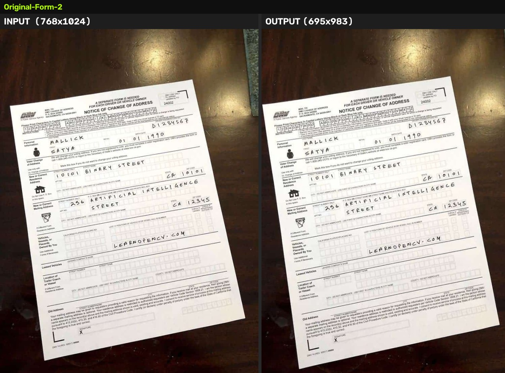
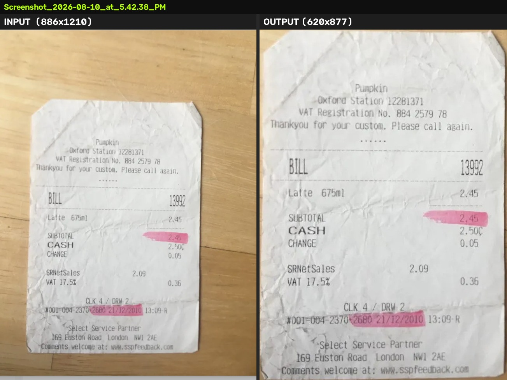
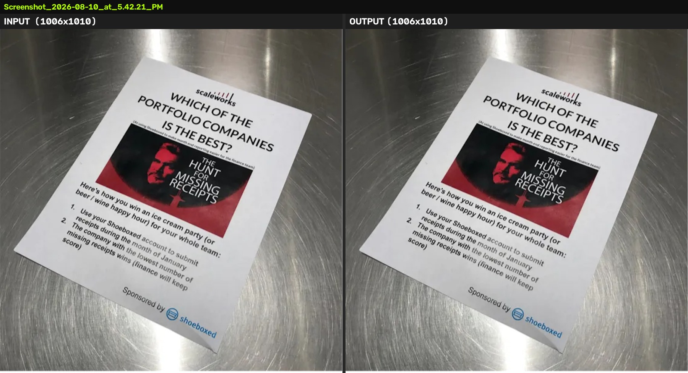

# Phone-Photo Document Rectification — Approach Report

## The problem

Most PDFs coming into the translation pipeline are genuine scans — flat,
clean, ready for layout extraction. A meaningful minority aren't: someone
photographed a form on a desk with their phone and converted that photo to
a PDF. Perspective distortion, background clutter, and skew break the
downstream layout-extraction stage the same way a crooked page would break
OCR.

The goal: detect those phone-photo pages, flatten them the way a scanner
app would, and leave everything else — real scans, born-digital PDFs —
completely untouched. A false positive (mangling a real scan) is worse
than a false negative (missing a phone photo), so the whole design leans
conservative.

## Why classical CV, not a model

This is a well-studied problem with an established classical answer. A
2009 paper (Silva, Lins et al.) got >99.9% accuracy separating scanned
from photographed documents using hand-crafted features, no learned model
involved. Document-boundary detection has the same story — the technique
behind Dropbox's production scanner, and the one CamScanner-style tools
use, is classical contour/line/segmentation work, not a neural net. That
meant no training data, no GPU, no model-serving infrastructure, and a
system where every failure mode is something we can point at and reason
about directly.

## Non-ML techniques used

Everything below is OpenCV / NumPy / PyMuPDF. No models, no OCR, no network
calls.

- **EXIF inspection** (Pillow) — camera metadata (Make/Model/FocalLength)
  is strong evidence of a phone photo; its absence proves nothing (most
  converters strip it), so it's one signal among several, not a verdict.
- **Weighted multi-signal scoring** — the classifier combines EXIF,
  border color/texture, illumination uniformity, sharpness falloff, and
  text-line tilt into one confidence score, cheapest signal first.
- **Illumination normalization** (divide by a heavily Gaussian-blurred
  copy of the image) — strips out shadows and vignetting before edge
  detection, so a phone's shadow doesn't get mistaken for a page edge.
- **Bilateral filtering** — smooths background texture (wood grain,
  fabric) while preserving sharp edges, so the real page boundary survives
  noise suppression.
- **Auto-Canny edge detection** (thresholds derived from the image's own
  median, not fixed constants) — avoids the well-known trap where a fixed
  Canny threshold works on one background and floods with noise on another.
- **Contour detection + convex hull + polygon approximation**
  (`findContours`, `approxPolyDP`) — the fast path when all four page
  corners are cleanly visible.
- **Hough line transform + line-intersection quad scoring** — the
  workhorse for harder cases: instead of hunting for corners directly
  (which breaks if one is occluded), find the four boundary *lines* and
  intersect them, then score every plausible combination by how well it's
  supported by the edge map. This is the same structure Dropbox published
  for their production scanner.
- **GrabCut** (graph-cut foreground/background segmentation) — fallback
  for cluttered or low-contrast backgrounds where no single edge is strong
  enough to trust; segments by color/region statistics instead of edges.
- **Adaptive thresholding + morphological filtering** — builds a
  "where's the real text" mask, used as a sanity check that a candidate
  boundary isn't cropping off actual page content.
- **Perspective transform** (`getPerspectiveTransform` +
  `warpPerspective`, Lanczos interpolation) — the actual flattening step,
  applied once, at full source resolution.
- **Native PDF image extraction / reinjection** (PyMuPDF) — pages that
  don't need correction are never decoded or re-encoded; only the pages
  that get rectified have their embedded image replaced.

## The pipeline, three stages

1. **Classify** — phone photo, scan, or born-digital? If uncertain, treat
   it as "leave alone."
2. **Locate boundary** — a cascade from fast/strict to slow/lenient:
   contour tracing → line-intersection scoring → GrabCut segmentation →
   text-tilt-only fallback → give up cleanly. Each step only runs if the
   previous one failed or looked wrong.
3. **Flatten** — perspective-correct just the document region and rebuild
   the PDF, touching only the pages that needed it.

## How we validated it

Two tracks, because no real failure samples existed at the start:

1. **Synthetic ground truth.** A generator composites clean pages onto
   procedural backgrounds with known corner positions, applies realistic
   degradations (shadow, blur, occlusion, rotation), and checks the
   pipeline against that ground truth at scale — classifier accuracy,
   corner error, and the hard requirement that real scans are never
   falsely flagged.
2. **Real phone photos.** Synthetic data validates the math, but it can't
   invent the failure modes real cameras produce. Running the pipeline
   against actual photos — a form on a wood table, receipts on a dark
   counter, a flyer on brushed steel — is what actually surfaced the bugs
   below. The synthetic suite caught none of them on its own.

## Head-to-head examples

Full side-by-sides for all 11 test photos are in `head-to-head-comparison/`
(and `all_comparisons.pdf`). Three worth looking at directly:

**A clean win.** A DMV form photographed at an angle on a dark wood table,
flattened correctly on the first pass:

**A bug we caught and fixed.** A receipt's top edge had almost no contrast
against the table under it — a physically real low-contrast boundary, not
a code bug. The boundary detector picked the next-best line it could find,
a printed divider between two sections of the receipt, and confidently
cropped off the entire header (shop name, VAT number, first line item).
We caught this by comparing output against input side by side, added a
check that rejects a candidate boundary if it would discard too much of
the page's real text content, and that forced the pipeline to fall back to
GrabCut, which found the true edge correctly:

**Correct restraint.** A flyer shot at a steep angle on brushed, reflective
steel — genuinely too little edge contrast for any of the classical methods
to lock onto reliably. Rather than guess and risk a bad crop, the pipeline
reports "boundary not found" and leaves the page untouched:

## Where it stands

All 11 real test photos classify correctly. 10 of 11 flatten cleanly with
full content preserved and no resolution loss beyond the intended
background crop. The 11th is correctly recognized as unfixable and left
alone rather than guessed at — that's the intended behavior, not a gap.

Every threshold that drives a decision lives in one config object, so
future misclassifications can be tuned from production logs without
touching the detection logic itself.
